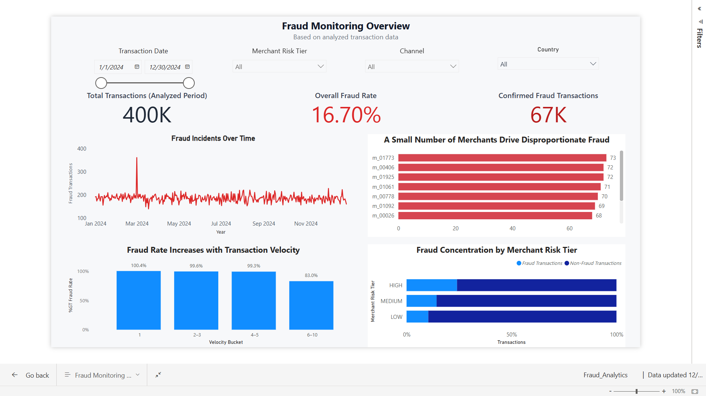

## Executive Summary

- **Business problem**: Fraud teams struggle to spot high-risk activity in millions of transactions without drowning in false positives.
- **Why it matters**: Excess alerts drive cost and analyst burnout, while missed or delayed detections increase fraud losses and regulatory risk.
- **What was built**: A SQL-first fraud intelligence and risk analytics platform that turns payment data into risk signals, prioritized queues, and dashboards.
- **Scale**: Built around 1.8M+ multi-table transactions (cards, devices, merchants, rules, investigator notes) to mirror real payment environments.
- **Key insights**: Surfaces velocity risk, merchant risk concentration, and behavioral anomalies to highlight the riskiest cards, devices, and merchants.
- **Business impact and relevance**: Targets a 25–35% improvement in investigation efficiency for FinTech, payments, and card programs by focusing work on the highest-value cases.

---

### Project Snapshot

> 📌 **Fraud Monitoring Overview (Power BI)**
>
> _Operational fraud monitoring dashboard used for daily risk oversight._
>
> <!-- TODO: Add screenshot -->
> 
>
> _Screenshot should show: KPIs, time trend, merchant concentration, velocity vs fraud, and risk tier distribution.  
> Capture full canvas with no Filters pane visible._

---

## Real-World Use Case

- **Where this system fits**
  - **FinTechs, payments processors, and acquirers** managing large-scale transactional flows.
  - **Digital wallets, BNPL providers, and neo-banks** balancing customer experience with strict risk controls.

- **Who uses it**
  - **Fraud analysts and investigators** reviewing high-risk transactions and entities.
  - **Risk operations teams and managers** overseeing queues, KPIs, and investigation SLAs.

- **How outputs are consumed**
  - **Interactive dashboards (Streamlit, Power BI)** for monitoring and drill-down.
  - **Prioritized transaction and entity views** to focus analyst effort.
  - **Exports and datasets** feeding BI tools, reports, or case management systems.

---

## High-Level Architecture

This project is built as an **analytics and decision-support pipeline**, aligned with how fraud analytics is run in production teams:

1. **Data generation & ingestion** – Create synthetic but representative payment and fraud data and load it into the database.
2. **Raw & staging layers (SQL)** – Clean, standardize, and enrich source tables using SQL as the single source of truth.
3. **Feature engineering** – Compute business-oriented fraud features (velocity, merchant risk, device patterns, behavioral deltas).
4. **Analytics & risk scoring** – Convert features into risk scores and explanations using models and heuristics.
5. **BI & reporting** – Export aggregated, denormalized tables for use in Power BI and other BI tools.
6. **Streamlit investigation** – Provide an interactive investigation console with filters, dashboards, and case views for analysts.

Detailed explanations of each stage are documented in the linked READMEs below.

> 📐 **System Architecture**
>
> <!-- TODO: Add architecture diagram -->
> 
>
> _Diagram should show: Data generation → SQL (raw/staging/features) → BI export → Power BI & Streamlit._

For deeper technical details, see the folder-level READMEs and docs:

- `docs/README.md` – setup, pipeline, and assets index  
- `data/README.md` – raw, processed, and BI datasets  
- `sql/README.md` – SQL pipeline and data layers  
- `src/README.md` – orchestration scripts and run order  
- `notebooks/README.md` – analytics notebooks and experimentation  
- `models/README.md` – model artifacts and regeneration notes  
- `streamlit_app/README.md` – shared Streamlit routing  
- `app/README.md` – Streamlit application and investigation workflows  
- `app-vizulation/README.md` – basic visualization mode  
- `powerbi/README.md` – BI layer and executive dashboards  
- `docs/data_pipeline.md` – narrative view of the end-to-end pipeline

---

## Repository Structure

The structure below shows how data, analytics code, and applications are organized across the repository.

<details>
<summary><strong>Click to expand project tree</strong></summary>

```text
fraud-intelligence-and-risk-analytics/
│
├── streamlit_app.py           # Unified entry point (mode selector for Basic / Advanced)
├── streamlit_app/             # Routing and shared Streamlit configuration
│   └── router.py
│
├── app/                       # Advanced investigation app (multi-page Streamlit)
│   ├── streamlit_app.py
│   ├── shared.py
│   ├── data_loader.py
│   ├── risk_scoring.py
│   ├── analytics.py
│   └── pages/
│       ├── 2_🔎_Risk_Explanation.py
│       ├── 3_📊_Analytics_Dashboard.py
│       └── 4_📥_Export_Documentation.py
│
├── app-vizulation/            # Basic mode (lightweight visualization app)
│   ├── streamlit_app.py
│   └── pages/
│       └── 1_📊_Interactive_Dashboard.py
│
├── sql/                       # SQL-first data pipeline (DDL, staging, features)
│   ├── ddl/
│   ├── staging/
│   └── features/
│
├── src/                       # Orchestration scripts for pipeline steps
│   ├── generate_raw_data.py
│   ├── load_raw_data.py
│   ├── export_bi_data.py
│   └── ...
│
├── notebooks/                 # Analysis, model experimentation, storytelling
│   ├── 06_fraud_analytics_storytelling.ipynb
│   └── 07_model_training_experimentation.ipynb
│
├── data/                      # Raw, processed, and BI-ready datasets
│   ├── raw/
│   ├── processed/
│   └── bi/
│
├── models/                    # Persisted ML models and metadata
├── docs/                      # Documentation and BI assets
│   └── Fraud_Analytics.pbix
└── requirements.txt / pyproject.toml
```

</details>

---

## Quick Start (How to Run Locally)

This project is designed to be **easy to run on a local laptop** while still reflecting production concepts.  
`uv` is recommended for faster, reproducible environments; `pip` instructions are provided for compatibility.

For a detailed, step-by-step setup guide (including screenshots and troubleshooting), see `docs/setup.md`. Below is the concise version.

### Option 1 – Using `uv` (recommended)

- **Clone the repository**
  - `git clone https://github.com/<your-username>/fraud-intelligence-and-risk-analytics-platform.git`
  - `cd fraud-intelligence-and-risk-analytics-platform`

- **Install dependencies**
  - `uv sync`

- **Prepare the database**
  - Ensure **MySQL 8+** is running.
  - Execute the DDL and staging SQL scripts under `sql/` as described in `docs/setup.md`.

- **Generate data and run the pipeline**
  - `uv run python src/generate_raw_data.py`
  - `uv run python src/load_raw_data.py`
  - Run the staging and feature SQL scripts in order (see `sql/README.md`).
  - `uv run python src/export_bi_data.py`

- **Launch the Streamlit app**
  - `uv run streamlit run streamlit_app.py`
  - Open `http://localhost:8501` in your browser.

### Option 2 – Using `pip`

- Create and activate a Python 3.11+ virtual environment.
- Install dependencies using `pip install -r requirements.txt`.
- Follow the same database, pipeline, and Streamlit steps as above.

> For environment variables, MySQL configuration, and common error patterns, see `docs/setup.md`.

---

## Key Outputs and Visuals

- **Power BI fraud analytics dashboard**
  - Executive-level overview of fraud rates, loss trends, and high-risk segments.
  - Drill-down into merchants, countries, channels, and time-of-day behavior.
  
  
  
  - **Interactive dashboard**: [View Power BI Report](https://app.powerbi.com/reportEmbed?reportId=31b9f9b4-cda8-4ca2-9412-5cbeb3b3acfb&autoAuth=true&embeddedDemo=true)
  - **Embed code** (for HTML pages or other markdown renderers):
    ```html
    <iframe title="Fraud_Analytics" width="1140" height="541.25" src="https://app.powerbi.com/reportEmbed?reportId=31b9f9b4-cda8-4ca2-9412-5cbeb3b3acfb&autoAuth=true&embeddedDemo=true" frameborder="0" allowFullScreen="true"></iframe>
    ```

- **Advanced Streamlit investigation console**
  - Multi-page workflow: transaction overview, risk explanation, analytics, exports.
  - Designed for daily use by fraud analysts and team leads.
  
  > 🧪 **Streamlit Investigation Console**
  >
  > <!-- TODO: Add Streamlit screenshot -->
  > 
  >
  > _Screenshot should show: filters, risk score, transaction table, and explainable risk features._

- **Basic Streamlit dashboard**
  - Lightweight visualization mode for quick exploration and storytelling.
  - **Placeholder**: screenshots highlighting key charts and filters.

> 🎥 **Demo Walkthrough (Optional)**
>
> <!-- TODO: Add demo video link -->
> _A 2–3 minute walkthrough showing Power BI monitoring → Streamlit investigation → insights._
>
> Example:
> - Loom / YouTube link here

All visual assets and future PDFs will live under `docs/assets/` to keep the repository structured and GitHub-friendly.

---

## Results and Insights

- **Velocity-driven risk**: Transactions with unusually high short-window velocity show significantly higher fraud rates → these segments warrant tighter controls and closer review.
- **Merchant risk concentration**: A small subset of merchants and MCCs contributes a large share of fraud losses (often 60–80% of losses in practice) → risk and monitoring effort should be focused on these concentrations.
- **Behavioral anomalies at card level**: Strong deviations from a card’s historical spend patterns correlate with elevated fraud risk → behavioral baselines are valuable inputs into decisioning.
- **Channel and device patterns**: Specific combinations of device type, channel, and IP geography recur in fraud cases → targeted controls can reduce risk without excessive friction for the full portfolio.
- **Operational impact**: Moving from raw lists to prioritized queues with explanations reduces low-value reviews → analysts can spend more time on the cases with the highest marginal benefit.

> These insights are indicative and based on the synthetic data and risk logic in this project, but mirror real-world patterns observed in payments and card fraud programs.

---

## Documentation Index

Deeper technical and process documentation is organized by area below.

- **Environment and setup**
  - `docs/setup.md` – environment, database, and app setup; uv vs pip; common issues.

- **Data and pipeline**
  - `docs/data_pipeline.md` – narrative overview of the data pipeline and design choices.
  - `sql/README.md` – raw, staging, and feature layers; execution order and logic.

- **Analytics, modeling, and storytelling**
  - `notebooks/README.md` – role of notebooks, experimentation vs production, storytelling.
  - `docs/interview_guide.md` – how to present this project in interviews.

- **Applications and BI**
  - `app/README.md` – Streamlit app, user journeys, and local run instructions.
  - `powerbi/README.md` – Power BI model, KPIs, slicers, and drill-down patterns.

All documentation is written to be **portfolio-ready** for GitHub and **interview-ready** for discussions with hiring managers, fraud leaders, and senior data professionals.
